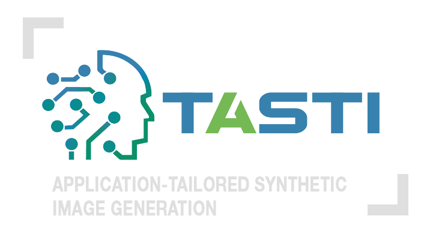

<p align="center">
  
</p>

# GenerativeZoo

[](https://www.python.org/downloads/release/python-3918/)
[](https://github.com/psf/black)
[](https://pycqa.github.io/isort)
[](https://mkdocstrings.github.io)
[](https://wandb.ai/site)
[](https://dvc.org)
[](https://hydra.cc)
[](https://github.com/PyCQA/bandit)

A collection of generative algorithms and techniques implemented in Python.

**This work is part of the Xecs TASTI project, nr. 2022005.**

## Prerequisites

You will need:

- `python` (see `pyproject.toml` for full version)
- `Git`
- `Make`
- a `.secrets` file with the required secrets and credentials
- load environment variables from `.env`
- `NVIDIA Drivers`(mandatory) and `CUDA >= 12.1` (mandatory if Docker/Apptainer is not used)
- `Weights & Biases` account

## Installation

Clone this repository (requires git ssh keys)

    git clone --recursive git@github.com:caetas/GenerativeZoo.git
    cd GenerativeZoo

### Using Docker or Apptainer

Create a `.secrets` file and add your Weights & Biases API Key:

    WANDB_API_KEY = <your-wandb-api-key>

#### Docker

Create the image using the provided [`Dockerfile`](Dockerfile)

    docker build --tag generativezoo .

Or download it from the Hub:

    docker pull docker://ocaetas/generativezoo

Then run the script [`job_docker.sh`](scripts/job_docker.sh) that will execute [`main.sh`](scripts/main.sh):

    cd scripts
    bash job_docker.sh

To access the shell, please run:

    docker run --rm -it --gpus all --ipc=host --env-file .env -v $(pwd)/:/app/ generativezoo bash

#### Apptainer

Convert the Docker Image to a `.sif` file:

    apptainer pull generativezoo.sif docker://ocaetas/generativezoo

Then run the script [`job_apptainer.sh`](scripts/job_apptainer.sh) that will execute [`main.sh`](scripts/main.sh):
    
    cd scripts
    bash job_apptainer.sh

To access the shell, please run:

    apptainer shell --nv --env-file .env --bind $(pwd)/:/app/ generativezoo.sif

**Add the flag `--nvccli` if you are using WSL.**

**Note: Edit the [`main.sh`](scripts/main.sh) script if you want to train a different model.**

### Normal Installation

Create the Conda Environment:

    conda env create -f environment.yml
    conda activate python3.10

#### On Linux

And then setup all virtualenv using make file recipe

    (python3.10) $ make setup-all

You might be required to run the following command once to setup the automatic activation of the conda environment and the virtualenv:

    direnv allow

Feel free to edit the [`.envrc`](.envrc) file if you prefer to activate the environments manually.

#### On Windows

You can setup the virtualenv by running the following commands:

    python -m venv .venv-dev
    .venv-dev/Scripts/Activate.ps1
    python -m pip install --upgrade pip setuptools
    python -m pip install -r requirements/requirements.txt


To run the code please remember to always activate both environments:

    conda activate python3.10
    .venv-dev/Scripts/Activate.ps1

## Models

### Implemented Models

The listed models are already implemented and fully integrated in the model zoo. Models with 🚀 support Multi-GPU and Mixed Precision training using [`Accelerate`](https://huggingface.co/docs/accelerate/en/index). Models with 📦 support a latent space implementation with the flag `--latent`.

#### VAEs

- Vanilla VAE [`Paper`](https://arxiv.org/abs/1312.6114) | [`Code`](src/generativezoo/models/VAE/VanillaVAE.py)<sup>1</sup> | [`Script`](src/generativezoo/VanVAE.py) | [`Documentation`](docs/VanillaVAE.md)
- Conditional VAE [`Paper`](https://openreview.net/forum?id=rJWXGDWd-H) | [`Code`](src/generativezoo/models/VAE/ConditionalVAE.py)<sup>1</sup> | [`Script`](src/generativezoo/CondVAE.py) | [`Documentation`](docs/ConditionalVAE.md)
- Hierarchical VAE [`Paper`](https://arxiv.org/abs/2007.03898) | [`Code`](src/generativezoo/models/VAE/HierarchicalVAE.py)<sup>2</sup> | [`Script`](src/generativezoo/HVAE.py) | [`Documentation`](docs/HierarchicalVAE.md)

#### GANs

- Adversarial VAE [`Paper`](https://arxiv.org/abs/1511.05644) | [`Code`](src/generativezoo/models/GAN/AdversarialVAE.py)<sup>1</sup> | [`Script`](src/generativezoo/AdvVAE.py) | [`Documentation`](docs/AdversarialVAE.md)
- DC-GAN [`Paper`](https://arxiv.org/abs/1511.06434) | [`Code`](src/generativezoo/models/GAN/DCGAN.py)<sup>3</sup> | [`Script`](src/generativezoo/DCGAN.py) | [`Documentation`](docs/DCGAN.md)
- Conditional GAN [`Paper`](https://arxiv.org/abs/1411.1784) | [`Code`](src/generativezoo/models/GAN/ConditionalGAN.py)<sup>3</sup> | [`Script`](src/generativezoo/CondGAN.py) | [`Documentation`](docs/ConditionalGAN.md)
- CycleGAN [`Paper`](https://arxiv.org/abs/1703.10593) | [`Code`](src/generativezoo/models/GAN/CycleGAN.py)<sup>4</sup> | [`Script`](src/generativezoo/CycGAN.py) | [`Documentation`](docs/CycleGAN.md)
- Prescribed GAN [`Paper`](https://arxiv.org/abs/1910.04302) | [`Code`](src/generativezoo/models/GAN/PrescribedGAN.py)<sup>5</sup> | [`Script`](src/generativezoo/PresGAN.py) | [`Documentation`](docs/PrescribedGAN.md)
- Wasserstein GAN with Gradient Penalty [`Paper`](https://arxiv.org/abs/1704.00028) | [`Code`](src/generativezoo/models/GAN/WGAN.py)<sup>6</sup> | [`Script`](src/generativezoo/WGAN.py) | [`Documentation`](docs/WassersteinGAN.md)

#### DDPMs

- DDPM<sup>🚀📦</sup> [`Paper`](https://arxiv.org/abs/2006.11239) | [`Code`](src/generativezoo/models/DDPM/DDPM.py)<sup>7,8,9,21</sup> | [`Script`](src/generativezoo/DDPM.py) | [`Documentation`](docs/DDPM.md)
- Conditional DDPM<sup>🚀📦</sup> [`Paper`](https://arxiv.org/abs/2207.12598) | [`Code`](src/generativezoo/models/DDPM/ConditionalDDPM.py)<sup>10,21</sup> | [`Script`](src/generativezoo/CondDDPM.py) | [`Documentation`](docs/ConditionalDDPM.md)
- Diffusion AE [`Paper`](https://arxiv.org/abs/2111.15640) | [`Code`](src/generativezoo/models/DDPM/MONAI_DiffAE.py)<sup>11</sup> | [`Script`](src/generativezoo/DAE.py) | [`Documentation`](docs/DiffusionAE.md)

#### Score Matching

- SGM<sup>🚀📦</sup> [`Paper`](https://arxiv.org/abs/2006.09011) | [`Code`](src/generativezoo/models/SM/SGM.py)<sup>12,21</sup> | [`Script`](src/generativezoo/SGM.py) | [`Documentation`](docs/SGM.md)
- NCSNv2 [`Paper`](https://arxiv.org/abs/2006.09011) | [`Code`](src/generativezoo/models/SM/NCSNv2.py)<sup>13</sup> | [`Script`](src/generativezoo/NCSNv2.py) | [`Documentation`](docs/NCSNv2.md)

#### Autoregressive

- VQ-VAE + Transformer [`Paper`](https://arxiv.org/abs/1711.00937) | [`Code`](src/generativezoo/models/AR/VQVAE_Transformer.py)<sup>11</sup> | [`Script`](src/generativezoo/VQVAE_T.py) | [`Documentation`](docs/VQVAE_Transformer.md)
- VQ-GAN + Transformer [`Paper`](https://arxiv.org/abs/2012.09841) | [`Code`](src/generativezoo/models/AR/VQGAN_Transformer.py)<sup>11</sup> | [`Script`](src/generativezoo/VQGAN_T.py) | [`Documentation`](docs/VQGAN_Transformer.md)
- PixelCNN [`Paper`](https://arxiv.org/abs/1606.05328) | [`Code`](src/generativezoo/models/AR/PixelCNN.py)<sup>14</sup> | [`Script`](src/generativezoo/P-CNN.py) | [`Documentation`](docs/PixelCNN.md)

#### Normalizing Flows

- Vanilla Flow [`Paper`](https://arxiv.org/abs/1505.05770) | [`Code`](src/generativezoo/models/NF/VanillaFlow.py)<sup>14</sup> | [`Script`](src/generativezoo/VanFlow.py) | [`Documentation`](docs/VanillaFlow.md)
- RealNVP [`Paper`](https://arxiv.org/abs/1605.08803) | [`Code`](src/generativezoo/models/NF/RealNVP.py)<sup>15</sup> | [`Script`](src/generativezoo/RNVP.py) | [`Documentation`](docs/RealNVP.md)
- Glow [`Paper`](https://arxiv.org/abs/1807.03039) | [`Code`](src/generativezoo/models/NF/Glow.py)<sup>16</sup> | [`Script`](src/generativezoo/GLOW.py) | [`Documentation`](docs/Glow.md)
- Flow++ [`Paper`](https://arxiv.org/abs/1902.00275) | [`Code`](src/generativezoo/models/NF/FlowPlusPlus.py)<sup>17</sup> | [`Script`](src/generativezoo/FlowPP.py) | [`Documentation`](docs/FlowPlusPlus.md)

#### Flow Matching

- Flow Matching<sup>🚀📦</sup> [`Paper`](https://arxiv.org/abs/2210.02747) | [`Code`](src/generativezoo/models/FM/FlowMatching.py)<sup>18,21</sup> | [`Script`](src/generativezoo/FM.py) | [`Documentation`](docs/FlowMatching.md)
- Conditional Flow Matching<sup>🚀📦</sup> [`Paper`](https://arxiv.org/abs/2210.02747) | [`Code`](src/generativezoo/models/FM/CondFlowMatching.py)<sup>18,21</sup> | [`Script`](src/generativezoo/CondFM.py) | [`Documentation`](docs/ConditionalFlowMatching.md)
- Rectified Flows<sup>🚀📦</sup> [`Paper`](https://arxiv.org/abs/2403.03206) | [`Code`](src/generativezoo/models/FM/RectifiedFlows.py)<sup>19</sup> | [`Script`](src/generativezoo/RF.py) | [`Documentation`](docs/RectifiedFlows.md)

#### Stable Diffusion

- Stable Diffusion + LoRA<sup>🚀</sup> [`Paper`](https://arxiv.org/abs/2106.09685) | [`Code`](src/generativezoo/models/SD/Text2Img_Lora.py)<sup>20</sup> | [`Script`](src/generativezoo/Text2Img_LoRA.py) | [`Documentation`](docs/Text2Img_LoRA.md)
- ControlNet<sup>🚀</sup> [`Paper`](https://arxiv.org/abs/2302.05543) | [`Code`](src/generativezoo/models/SD/Text2Img_Controlnet.py)<sup>20</sup> | [`Script`](src/generativezoo/Text2Img_ControlNet.py) | [`Documentation`](docs/Text2Img_ControlNet.md)
- InstructPix2Pix<sup>🚀</sup> [`Paper`](https://arxiv.org/abs/2211.09800) | [`Code`](src/generativezoo/models/SD/InstructPix2Pix.py)<sup>20</sup> | [`Script`](src/generativezoo/InstructPix2Pix.py) | [`Documentation`](docs/InstructPix2Pix.md)

## Multi-GPU support and Mixed  Precision

[`Accelerate`](https://huggingface.co/docs/accelerate/en/index) should be configured for your hardware setup using:

    accelerate config

The models that support these features should be launched with:

    accelerate launch --multi_gpu --mixed_precision=fp16 --num_processes=2 {script_name.py} {--arg1} {--arg2} ...

## Datasets

The following datasets are ready to be used to train and sample from the provided models. They are automatically downloaded when you try to use them for the first time.

### Grayscale

- MNIST [`Source`](https://ieeexplore.ieee.org/document/726791)
- FashionMNIST [`Source`](https://arxiv.org/abs/1708.07747)
- ChestMNIST++ [`Source`](https://www.nature.com/articles/s41597-022-01721-8)
- OctMNIST++ [`Source`](https://www.nature.com/articles/s41597-022-01721-8)
- PneumoniaMNIST++ [`Source`](https://www.nature.com/articles/s41597-022-01721-8)
- TissueMNIST++ [`Source`](https://www.nature.com/articles/s41597-022-01721-8)

### RGB

- CIFAR-10 [`Source`](https://www.cs.toronto.edu/%7Ekriz/cifar.html)
- CIFAR-100 [`Source`](https://www.cs.toronto.edu/%7Ekriz/cifar.html)
- SVHN [`Source`](https://arxiv.org/abs/1312.6082)
- Places365 [`Source`](https://arxiv.org/abs/1909.02410)
- DTD [`Source`](https://arxiv.org/abs/1311.3618)
- TinyImageNet [`Source`](https://cs231n.stanford.edu/reports/2015/pdfs/yle_project.pdf) **MANUAL DOWNLOAD REQUIRED** [`Link`](https://www.kaggle.com/datasets/nikhilshingadiya/tinyimagenet200)
- Horse2Zebra [`Source`](https://arxiv.org/abs/1703.10593v6) **MANUAL DOWNLOAD REQUIRED** [`Link`](https://www.kaggle.com/datasets/balraj98/horse2zebra-dataset)
- ImageNet-1k [`Source`](https://ieeexplore.ieee.org/abstract/document/5206848)
- CelebA [`Source`](https://arxiv.org/abs/1411.7766)

## Tracking

The code examples are setup to use [Weights & Biases](https://wandb.ai/home) as a tool to track your training runs. Please refer to the [`full documentation`](https://docs.wandb.ai/quickstart) if required or follow the following steps:

1. Create an account in [Weights & Biases](https://wandb.ai/home)
2. **If you have installed the requirements you can skip this step**. If not, activate the conda environment and the virtualenv and run:

    ```bash
    pip install wandb
    ```
3. Run the following command and insert you [`API key`](https://wandb.ai/authorize) when prompted:

    ```bash
    wandb login
    ```

**If you want to fully disable Weights & Biases during training, use the flag `--no_wandb`.**

**If you want to turn off syncing with the server but want to retain the local copy, run:**

```bash
wandb offline 
```

## Repository Information

### Documentation

Full documentation is available here: [`docs/`](docs).

### Dev

See the [Developer](docs/DEVELOPER.md) guidelines for more information.

### Contributing

Contributions of any kind are welcome. Please read [CONTRIBUTING.md](docs/CONTRIBUTING.md]) for details and
the process for submitting pull requests to us.

**Please read [MODELRULES.md](docs/MODELRULES.md) for details on how you should build your models for this repository.**

### Security

Thank you for improving the security of the project, please see the [Security Policy](docs/SECURITY.md)
for more information.

## License

This project is licensed under the terms of the `CC-BY-4.0` license.
See [LICENSE](LICENSE) for more details.

## References

All the repositories used to generate this code are mentioned in each of the corresponding files and referenced in [`Implemented Models`](#implemented-models):

1. [PyTorch-VAE](https://github.com/AntixK/PyTorch-VAE)
2. [nvae](https://github.com/GlassyWing/nvae)
3. [conditional-GAN](https://github.com/TeeyoHuang/conditional-GAN)
4. [PyTorch-GAN](https://github.com/eriklindernoren/PyTorch-GAN)
5. [PresGANs](https://github.com/adjidieng/PresGANs/)
6. [wgan-gp](https://github.com/EmilienDupont/wgan-gp)
7. [minDiffusion](https://github.com/cloneofsimo/minDiffusion)
8. [DenoisingDiffusionProbabilisticModels](https://github.com/DhruvSrikanth/DenoisingDiffusionProbabilisticModels)
9. [ddim](https://github.com/ermongroup/ddim)
10. [Conditional_Diffusion_MNIST](https://github.com/TeaPearce/Conditional_Diffusion_MNIST)
11. [Generative Models](https://github.com/Project-MONAI/GenerativeModels)
12. [SGM Tutorial](https://colab.research.google.com/drive/120kYYBOVa1i0TD85RjlEkFjaWDxSFUx3?usp=sharing)
13. [score_sde_pytorch](https://github.com/yang-song/score_sde_pytorch)
14. [uvadlc_notebooks](https://github.com/phlippe/uvadlc_notebooks)
15. [real-nvp](https://github.com/chrischute/real-nvp)
16. [Glow-PyTorch](https://github.com/y0ast/Glow-PyTorch)
17. [flowplusplus](https://github.com/chrischute/flowplusplus)
18. [conditional-flow-matching](https://bm371613.github.io/conditional-flow-matching/)
19. [minRF](https://github.com/cloneofsimo/minRF)
20. [diffusers](https://github.com/huggingface/diffusers)
21. [guided-diffusion](https://github.com/openai/guided-diffusion)

## Citation

If you publish work that uses GenerativeZoo, please cite GenerativeZoo as follows:

```bibtex
@misc{GenerativeZoo,
author = {Francisco Caetano},
title = {A collection of generative algorithms and techniques implemented in Python.},
publisher = {GitHub},
journal = {GitHub repository},
howpublished = {\url{https://github.com/caetas/GenerativeZoo}},
year = {2024},
}
```
